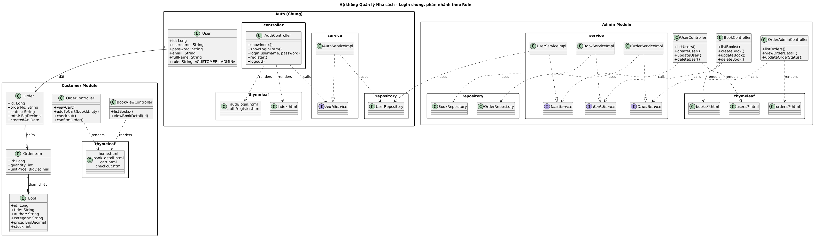

**Chức năng cơ bản:**
  - Quản lý sách (thêm, sửa, xóa, tìm kiếm).
  - Quản lý khách hàng.
  - Quản lý đơn hàng / bán sách.
  - Báo cáo doanh thu (nếu còn thời gian).
  - Quản lý nhân viên (option)
  - Chatbot tìm sách, tóm tắt nội dung (option)

**Công nghệ:**
- Java 17 + Spring Boot 3.2.0
- SQL Server
- Spring Data JPA, Spring Security
- Maven, Lombok
- SpringDoc OpenAPI (Swagger)
- Chức năng của từng folder:
  - Config: Chứa các class cấu hình (Cấu hình Db, Cấu hình Web, Cấu hình bảo mật)
  - Controller: Chứa các controller của các entity
  - dto: design pattern của SpringBoot (Tách biệt entity và api, bảo mật, validation input)
  - entity: chứa các đối tượng của dự án(User, ...)
  - Exception: chứa các exception để debug
  - repository(truy cập dữ liệu trong SpringBoot, cầu nối giữa Service và Db)
  - util: chứa tiện ích có thể sử dụng lại
  - resources: tài nguyên, sql
  - pom.xml: các thư viện sử dụng

## Cấu trúc dự án
```
BTL_OOP/
├── src/
│   ├── main/
│   │   ├── java/com/btl/oop/
│   │   │   ├── BtlOopApplication.java          # Main application class
│   │   │   ├── config/                        # Configuration classes
│   │   │   │   ├── DatabaseConfig.java
│   │   │   │   ├── SecurityConfig.java
│   │   │   │   └── WebConfig.java
│   │   │   ├── controller/                    # REST Controllers
│   │   │   │   └── UserController.java
│   │   │   ├── dto/                          # Data Transfer Objects
│   │   │   │   ├── ApiResponseDTO.java
│   │   │   │   ├── UserRequestDTO.java
│   │   │   │   └── UserResponseDTO.java
│   │   │   ├── entity/                       # JPA Entities
│   │   │   │   ├── BaseEntity.java
│   │   │   │   └── User.java
│   │   │   ├── exception/                    # Custom Exceptions
│   │   │   │   ├── DuplicateResourceException.java
│   │   │   │   ├── GlobalExceptionHandler.java
│   │   │   │   └── ResourceNotFoundException.java
│   │   │   ├── repository/                   # Data Access Layer
│   │   │   │   └── UserRepository.java
│   │   │   ├── service/                      # Business Logic Layer
│   │   │   │   ├── UserService.java
│   │   │   │   └── impl/
│   │   │   │       └── UserServiceImpl.java
│   │   │   └── util/                         # Utility Classes
│   │   │       └── MapperUtil.java
│   │   └── resources/
│   │       ├── application.properties        # Application configuration
│   │       └── schema.sql                   # Database schema
│   └── test/                                # Test classes
├── pom.xml                                  # Maven dependencies
└── README.md                               # Project documentation
```

## Các Entity cần thêm cho hệ thống nhà sách
- **Book** - Quản lý sách
- **Customer** - Quản lý khách hàng  
- **Order** - Quản lý đơn hàng
- **OrderItem** - Chi tiết đơn hàng
- **Category** - Danh mục sách
- **Author** - Tác giả
- **Employee** - Nhân viên (option)
- **Revenue** - Báo cáo doanh thu (option)
- Java Spring Boot

## Class Diagram
