# Hướng dẫn dùng SQL Server

- [Hướng dẫn dùng SQL Server](#hướng-dẫn-dùng-sql-server)
  - [Dữ liệu mẫu](#dữ-liệu-mẫu)
  - [1. Select](#1-select)
    - [1.1.Truy vấn first\_name và last\_name](#11truy-vấn-first_name-và-last_name)
    - [1.2. Truy vấn first\_name, last\_name, email](#12-truy-vấn-first_name-last_name-email)
    - [1.3. Truy vấn toàn bộ tất cả các cột của bảng](#13-truy-vấn-toàn-bộ-tất-cả-các-cột-của-bảng)
    - [1.4 WHERE](#14-where)
    - [1.5 ORDER BY](#15-order-by)
    - [1.6 GROUP BY](#16-group-by)
    - [1.7 HAVING](#17-having)
  - [2. ORDER BY](#2-order-by)
    - [2.1. Mặc định](#21-mặc-định)
    - [2.2. Tăng dần](#22-tăng-dần)
    - [2.3. Giảm dần](#23-giảm-dần)
    - [2.4. Sắp xếp theo nhiều cột](#24-sắp-xếp-theo-nhiều-cột)
    - [2.5. Sắp xếp theo cột không được SELECT](#25-sắp-xếp-theo-cột-không-được-select)
    - [2.6 Sắp xếp theo biểu thức](#26-sắp-xếp-theo-biểu-thức)
  - [3. OFFSET FETCH](#3-offset-fetch)
    - [3.1. Lý thuyết](#31-lý-thuyết)
    - [3.2. Ví dụ](#32-ví-dụ)
      - [3.2.1. Tiêu chuẩn](#321-tiêu-chuẩn)
      - [3.2.2. Bỏ qua 10 dòng đầu](#322-bỏ-qua-10-dòng-đầu)
      - [3.2.3. Bỏ qua 10 dòng đầu và chọn 10 dòng tiếp theo](#323-bỏ-qua-10-dòng-đầu-và-chọn-10-dòng-tiếp-theo)
  - [4. TOP](#4-top)
    - [4.1. TOP với số lượng dòng cố định](#41-top-với-số-lượng-dòng-cố-định)
    - [4.2. TOP với phần trăm tất cả các dòng](#42-top-với-phần-trăm-tất-cả-các-dòng)
    - [4.3. TIES](#43-ties)
  - [5. DISTINCT](#5-distinct)
  - [6.NULL](#6null)
    - [6.1 Toán tử IS NULL](#61-toán-tử-is-null)


## Dữ liệu mẫu

Mình dùng dữ liệu mẫu **BikeStores** để minh họa các câu lệnh trong hướng dẫn

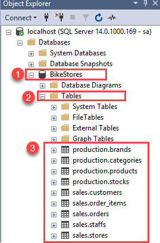

## 1. Select

SQL sử dụng `schema` để nhóm các bảng và đối tượng cơ sở dữ liệu khác một cách logic.

```sql
SELECT
    select_list
FROM
    schema_name.table_name;
```

**Syntax:**
- Đầu tiên, chỉ định danh sách các cột được phân cách bằng dấu phẩy mà bạn muốn truy vấn dữ liệu trong mệnh đề SELECT.

- Thứ hai, chỉ định tên bảng và lược đồ (schema) của nó trong mệnh đề FROM.

Khi xử lý câu lệnh SELECT, SQL Server sẽ xử lý mệnh đề FROM trước, sau đó mới đến mệnh đề SELECT, mặc dù mệnh đề SELECT xuất hiện trước mệnh đề FROM trong cú pháp.


Ví dụ trong `sample database`

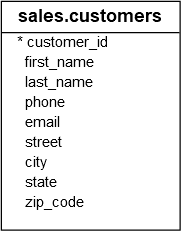


### 1.1.Truy vấn first_name và last_name
```sql
SELECT
    first_name,
    last_name
FROM
    sales.customers;
```

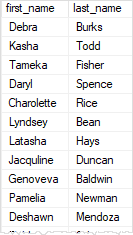

Kết quả của một `query` được gọi là `result set`

### 1.2. Truy vấn first_name, last_name, email

```sql
SELECT
    first_name,
    last_name,
    email
FROM
    sales.customers;
```

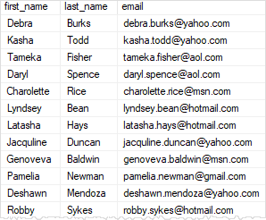

### 1.3. Truy vấn toàn bộ tất cả các cột của bảng

Sử dụng `SELECT *`

```sql
SELECT * FROM sales.customers;
```

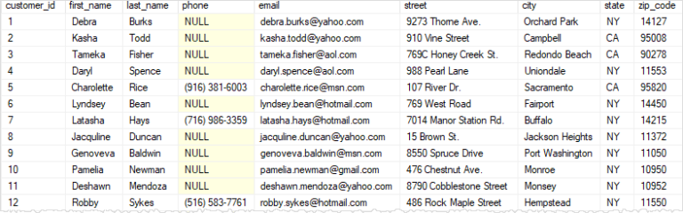

### 1.4 WHERE

Câu lệnh WHERE trong SQL được dùng để lọc các dòng dữ liệu trong bảng dựa trên một hoặc nhiều điều kiện cụ thể. Nó giúp bạn chỉ lấy ra những bản ghi phù hợp thay vì toàn bộ dữ liệu.

```sql
SELECT
    *
FROM
    sales.customers
WHERE
    state = 'CA';
```
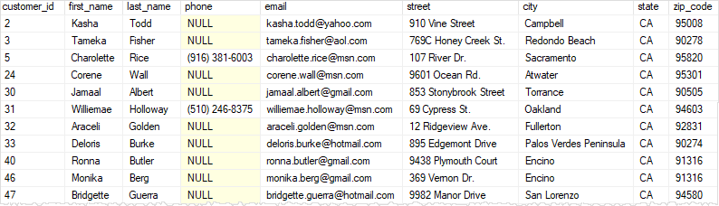

Luồng hoạt động:


### 1.5 ORDER BY

```sql
SELECT
    *
FROM
    sales.customers
WHERE
    state = 'CA'
ORDER BY
    first_name; // so sánh
```
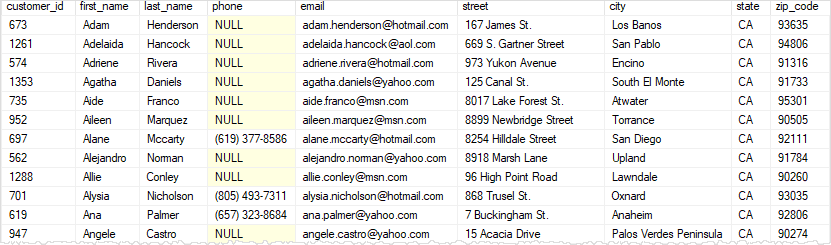

Luồng hoạt động:


### 1.6 GROUP BY

```sql
SELECT
    city,
    COUNT (*) // đếm số lượnglượng
FROM
    sales.customers
WHERE
    state = 'CA'
GROUP BY
    city    // gộp các hàng có cùng thành phố 
ORDER BY
    city;
```

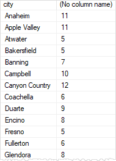

Luồng hoạt động


### 1.7 HAVING
```sql
SELECT
    city,
    COUNT (*)
FROM
    sales.customers
WHERE
    state = 'CA'
GROUP BY
    city
HAVING
    COUNT (*) > 10 // có số lượng > 10
ORDER BY
    city;
```

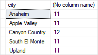

## 2. ORDER BY

### 2.1. Mặc định
```sql
SELECT
    first_name,
    last_name
FROM
    sales.customers
ORDER BY
    first_name; // sắp xếp theo tên (mặc định tăng dần)
```
### 2.2. Tăng dần

```sql
SELECT
    first_name,
    last_name
FROM
    sales.customers
ORDER BY
    first_name ASC; // sắp xếp tăng dần 
```
### 2.3. Giảm dần 

```sql
SELECT
    firstname,
    lastname
FROM
    sales.customers
ORDER BY
    first_name DESC; // sắp xếp giảm dần
```

### 2.4. Sắp xếp theo nhiều cột

```sql
SELECT
    city,
    first_name,
    last_name
FROM
    sales.customers
ORDER BY
    city,       // sắp xếp theo city trước
    first_name DESC; // sắp xếp theo first_name sau
```

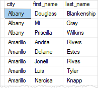

### 2.5. Sắp xếp theo cột không được SELECT

```sql
SELECT
    city,
    first_name,
    last_name
FROM
    sales.customers
ORDER BY
    state;
```

### 2.6 Sắp xếp theo biểu thức

```sql 
SELECT
    first_name,
    last_name
FROM
    sales.customers
ORDER BY
    LEN(first_name) DESC; // Sắp xếp giảm dần theo độ dài first_name
```

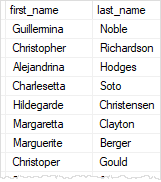

## 3. OFFSET FETCH
### 3.1. Lý thuyết 
Các mệnh đề `OFFSET` và `FETCH` là tùy chọn của mệnh đề `ORDER BY`. Chúng cho phép bạn giới hạn số lượng dòng được trả về bởi một truy vấn.

```sql
ORDER BY column_list [ASC |DESC]
OFFSET offset_row_count {ROW | ROWS}
FETCH {FIRST | NEXT} fetch_row_count {ROW | ROWS} ONLY
```

**Giải thích cú pháp:**
- Mệnh đề `OFFSET` chỉ định số dòng cần bỏ qua trước khi bắt đầu trả về kết quả từ truy vấn. `offset_row_count` có thể là một hằng số, biến hoặc tham số, và phải lớn hơn hoặc bằng 0.

- Mệnh đề `FETCH` chỉ định số dòng cần lấy sau khi đã xử lý `OFFSET`. `fetch_row_count` có thể là một hằng số, biến hoặc giá trị đơn, và phải lớn hơn hoặc bằng 1.

- Mệnh đề `OFFSET`   là bắt buộc, trong khi `FETCH` là tùy chọn.

- Các từ khóa `FIRST` và `NEXT` là từ đồng nghĩa, có thể sử dụng thay thế cho nhau. Tương tự, bạn có thể dùng `ROW` hoặc `ROWS` mà không ảnh hưởng đến kết quả.

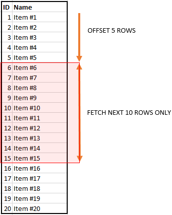

> **Lưu ý**
>- Điều quan trọng cần lưu ý là bạn phải sử dụng các mệnh đề `OFFSET` và `FETCH` cùng với mệnh đề `ORDER BY`. Nếu không, bạn sẽ gặp lỗi.
>- Các mệnh đề `OFFSET` và `FETCH` được ưu tiên sử dụng hơn so với mệnh đề `TOP` khi triển khai giải pháp phân trang truy vấn.

### 3.2. Ví dụ
#### 3.2.1. Tiêu chuẩn
```sql
SELECT
    product_name,
    list_price
FROM
    production.products
ORDER BY
    list_price,
    product_name;
// không bỏ dòng nào 
```

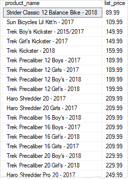

#### 3.2.2. Bỏ qua 10 dòng đầu 

```sql
SELECT
    product_name,
    list_price
FROM
    production.products
ORDER BY
    list_price,
    product_name 
OFFSET 10 ROWS; // bỏ qua 10 dòng đầu
```
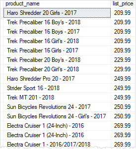

#### 3.2.3. Bỏ qua 10 dòng đầu và chọn 10 dòng tiếp theo
```sql
SELECT
    product_name,
    list_price
FROM
    production.products
ORDER BY
    list_price,
    product_name 
OFFSET 10 ROWS              // bỏ qua 10 dòng đầu 
FETCH NEXT 10 ROWS ONLY;    // và lấy 10 dòng tiếp theo 
```
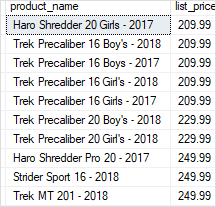

## 4. TOP

Mệnh đề `SELECT TOP` cho phép bạn giới hạn số lượng dòng hoặc phần trăm dòng được trả về bởi một truy vấn. Nó rất hữu ích khi bạn muốn lấy một số lượng dòng cụ thể từ một bảng lớn.

Vì thứ tự của các dòng được lưu trong bảng là không xác định, nên câu lệnh `SELECT TOP` luôn nên được sử dụng cùng với mệnh đề `ORDER BY`. Điều này đảm bảo rằng tập kết quả được giới hạn ở N dòng đầu tiên theo thứ tự đã chỉ định.

Syntax:
```sql
SELECT TOP (expression) [PERCENT]
    [WITH TIES]
FROM 
    table_name
ORDER BY 
    column_name;
```
Trong cú pháp này, câu lệnh `SELECT` có thể bao gồm các mệnh đề khác như `WHERE`, `JOIN`, cũng như `GROUP BY` và `HAVING`.

### 4.1. TOP với số lượng dòng cố định

```sql
SELECT TOP 10   //  10 dòng đầuđầu
    product_name, 
    list_price
FROM
    production.products
ORDER BY 
    list_price DESC;
```

### 4.2. TOP với phần trăm tất cả các dòng

```sql
SELECT TOP 1 PERCENT
    product_name, 
    list_price
FROM
    production.products
ORDER BY 
    list_price DESC;
```

### 4.3. TIES

```sql
SELECT TOP 3 WITH TIES
    product_name, 
    list_price
FROM
    production.products
ORDER BY 
    list_price DESC;
```
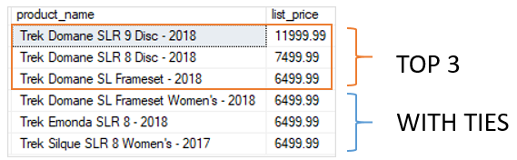

## 5. DISTINCT

Đôi khi, bạn có thể muốn lấy ra các giá trị duy nhất trong một cột cụ thể của bảng. Để làm được điều này, bạn có thể sử dụng mệnh đề SELECT DISTINCT.

```sql
SELECT DISTINCT
	column_name1,
	column_name2 ,
	...
FROM
	table_name;
```

## 6.NULL
`NULL` và logic ba giá trị Trong thế giới cơ sở dữ liệu, `NULL` được sử dụng để biểu thị sự vắng mặt của bất kỳ giá trị dữ liệu nào. Ví dụ, khi ghi lại thông tin khách hàng, địa chỉ email có thể chưa được biết, vì vậy bạn ghi nó là `NULL` trong cơ sở dữ liệu.

Thông thường, kết quả của một biểu thức logic là TRUE (đúng) hoặc FALSE (sai). Tuy nhiên, khi `NULL` tham gia vào quá trình đánh giá logic, kết quả có thể là UNKNOWN (không xác định). Do đó, một biểu thức logic có thể trả về một trong ba giá trị: TRUE, FALSE, và UNKNOWN.

The `NULL` does not equal anything, not even itself. It means that `NULL` is not equal to `NULL` because each `NULL` could be different.

### 6.1 Toán tử IS NULL

```sql
SELECT
    customer_id,
    first_name,
    last_name,
    phone
FROM
    sales.customers
WHERE
    phone IS NULL
ORDER BY
    first_name,
    last_name;
```

**...Đang cập nhật...**

Tài liệu tham khảo
[SQL Server Tutorial](https://www.sqlservertutorial.net/)
